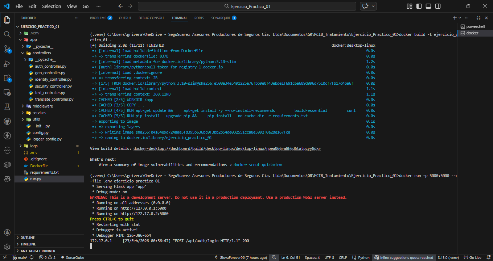
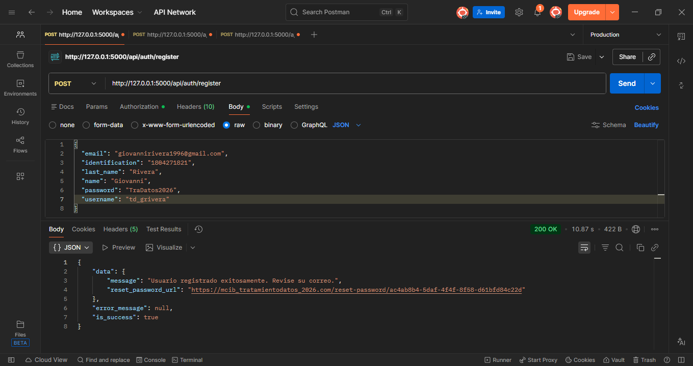
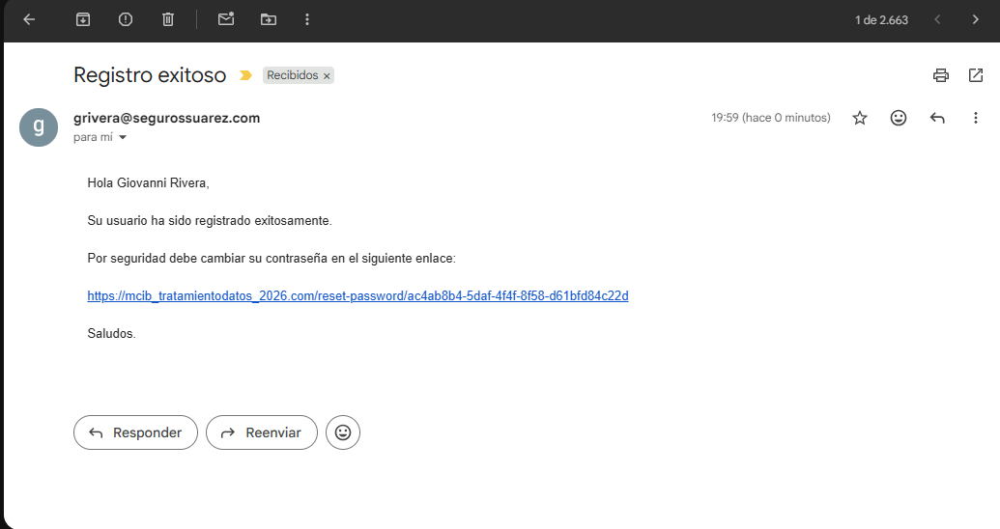
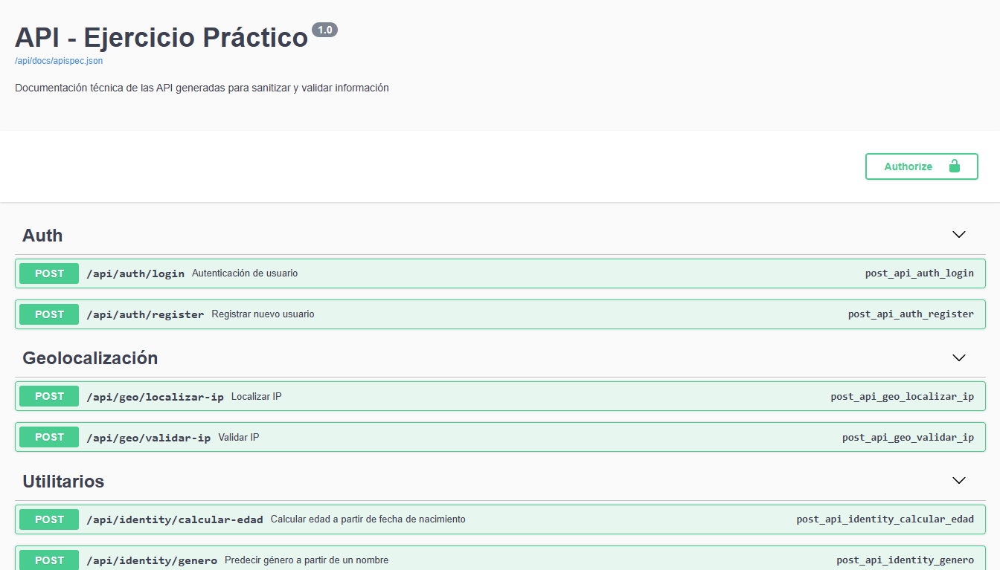
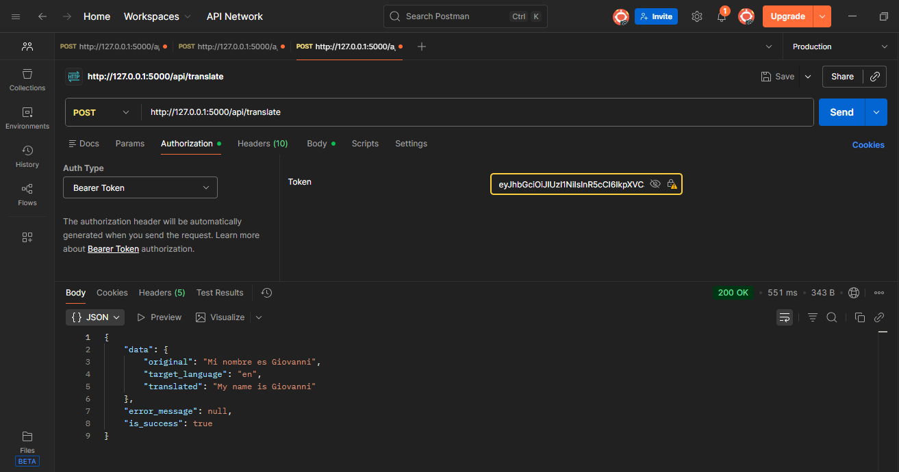
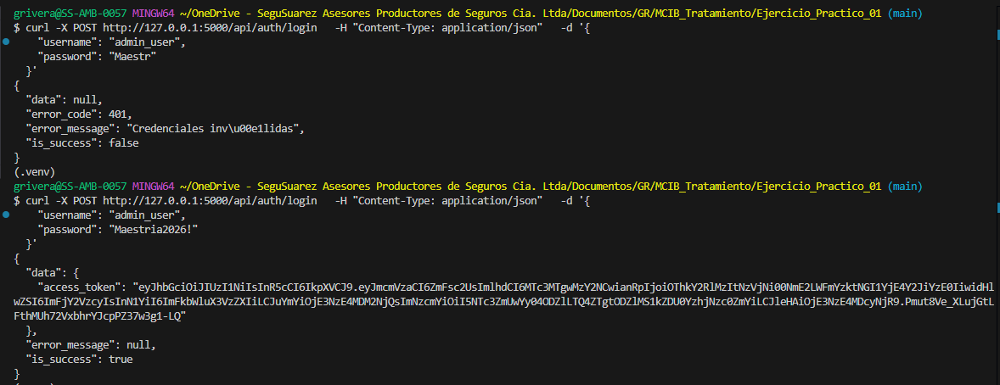
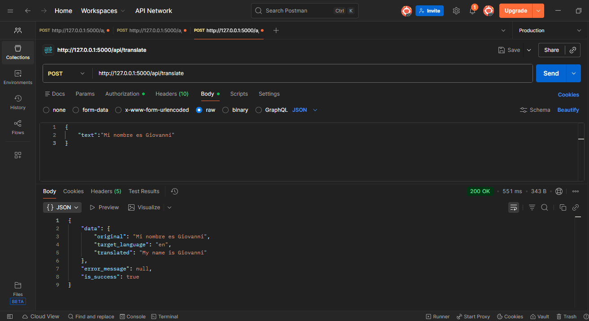
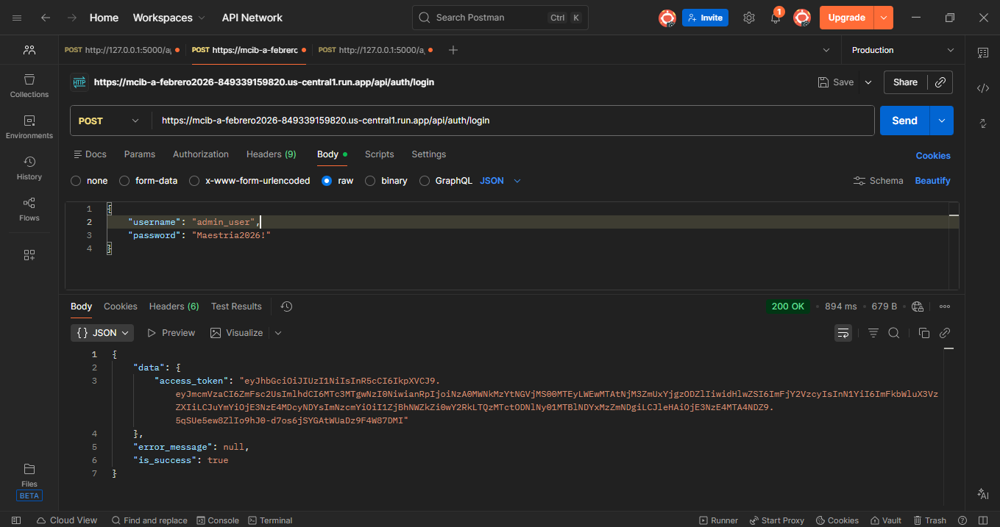

# API de Tratamiento y Validación de Datos

Aplicación Flask con autenticación JWT, documentación Swagger y servicios para sanitizar, validar y transformar información (texto, identidad, geolocalización, seguridad y traducción).

## Características

- Autenticación con JWT (`/api/auth/login`) y registro ficticio (`/api/auth/register`).
- Middleware de logging con salida JSON en `logs/app.log`.
- Documentación interactiva con Swagger en `/api/docs/`.
- Respuesta uniforme: `{ is_success, data, error_message, error_code }`.
- Servicios:
  - Identidad: validar cédula ecuatoriana, calcular edad, número a letras (USD), predicción de género.
  - Geolocalización: validar IP y obtener ubicación vía API externa.
  - Seguridad: evaluación de fortaleza de contraseña.
  - Texto: normalización y limpieza de caracteres.
  - Traducción: integración con Google Translate API.

## Requisitos

- Python 3.10+
- Dependencias en `requirements.txt`.

## Instalación (local)

1. Crear y activar un entorno virtual.
   - Windows (PowerShell):
     ```powershell
     python -m venv .venv
     .\.venv\Scripts\Activate.ps1
     ```
2. Instalar dependencias:
   ```bash
   pip install -r requirements.txt
   ```
3. Configurar variables de entorno en `.env` (ver sección siguiente).
4. Ejecutar la aplicación:
   ```bash
   python run.py
   ```
   - Servirá en `http://localhost:5000/`.

## Ejecución con Docker

1. Construir la imagen:
   ```bash
   docker build -t ejercicio-practico-api .
   ```
2. Ejecutar el contenedor (mapeando puerto 8080 externo al 5000 interno):
   ```bash
   docker run --env-file .env -p 8080:5000 ejercicio-practico-api
   ```
   - Acceso: `http://localhost:8080/` y documentación en `http://localhost:8080/api/docs/`.

### Capturas de Docker

- `assets/007.png` (configuración de Docker):

  

## Configuración de Docker

- Variables de entorno:
  - Usa `--env-file .env` para inyectar valores como `JWT_SECRET_KEY`, credenciales de login, `SMTP_USER` y `SMTP_PASSWORD`, y claves de APIs externas.
  - En producción, evita exponer `.env` y utiliza secretos seguros.

- Construcción y ejecución recomendada:
  ```bash
  docker build -t ejercicio-practico-api .
  docker run --name ejercicio-practico-api --env-file .env -p 8080:5000 ejercicio-practico-api
  ```

- Ver logs:
  ```bash
  docker logs -f ejercicio-practico-api
  ```
  - También se registran en `logs/app.log` dentro del contenedor.

- Red y puertos:
  - El contenedor expone el puerto interno `5000`. Mapea a `8080` o el que prefieras.
  - Para envío de correos, asegúrate de que el contenedor pueda salir por `SMTP_PORT=587`.

## Petición registro de usuario (Docker)

- curl (puerto mapeado a `8080`):
  ```bash
  curl -s -X POST http://localhost:8080/api/auth/register \
    -H "Content-Type: application/json" \
    -d '{
      "identification":"9999999999",
      "name":"Juan",
      "last_name":"Pérez",
      "username":"juanp",
      "email":"juan.perez@example.com",
      "password":"Secreta123!"
    }'
  ```

- Respuesta esperada:
  ```json
  {
    "is_success": true,
    "data": {
      "message": "Usuario registrado exitosamente. Revise su correo.",
      "reset_password_url": "https://mcib_tratamientodatos_2026.com/reset-password/<token>"
    },
    "error_message": null
  }
  ```

- Captura:
  - `assets/008.png` (petición de registro en Docker):

    

## Correo de notificación

- Envío de correo al registrar usuario:
  - Se realiza en `app/services/auth_service.py:35` usando SMTP configurado en `app/config.py:31`.
  - Requiere `SMTP_USER` y `SMTP_PASSWORD` válidos. Servidor: `smtp.office365.com`, puerto `587`.

- Ejemplo de contenido del correo:
  ```text
  Asunto: Registro exitoso

  Hola <name> <last_name>,

  Su usuario ha sido registrado exitosamente.
  Por seguridad debe cambiar su contraseña en el siguiente enlace:
  https://mcib_tratamientodatos_2026.com/reset-password/<token>

  Saludos.
  ```

- Capturas sugeridas:
- `assets/009.png` (correo de notificación):

    

(sin captura adicional requerida)

## Variables de entorno (.env)

```env
# ===============================
# Configuración de la aplicación
# ===============================
FLASK_ENV=development
DEBUG=True

# ==========================
# Configuración del token
# ==========================
JWT_SECRET_KEY=MTD_2026_JWT_Security_9xK4Lm2Qp8Rt5Zv3Ws7Yh1Cn6Bx0Da
JWT_ACCESS_TOKEN_EXPIRES=3600

# ==========================
# EXTERNAL APIs
# ==========================
IP_GEO_URL=https://ipwho.is
GENDERIZE_URL=https://api.genderize.io
REQUEST_TIMEOUT=5

# ==========================
# CREDENCIALES DE USUARIO
# ==========================
AUTH_USERNAME=admin_user
AUTH_PASSWORD=Maestria2026!

# ==========================
# CREDENCIALES DE EMAIL
# ==========================
SMTP_USER=usuario@tratamiento.com
SMTP_PASSWORD=tratamiento

# ============================
# CREDENCIALES DE GOOGLE CLOUD
# ============================
GOOGLE_API_KEY=kjb76sdiusfhsu98sudf-iou9iiasAj87dS
```

Notas:
- `IP_GEO_URL` apunta a `https://ipwho.is`, que responde con `success` y datos de ubicación.
- `GOOGLE_API_KEY` es requerida para `/api/translate`.
- `.env` está ignorado por `.gitignore` y no debe versionarse.

## Documentación Swagger

- Disponible en: `http://localhost:5000/api/docs/` (o en el puerto mapeado si usas Docker).
- Soporta seguridad Bearer: agrega `Authorization: Bearer <token>`.

- Pasos rápidos:
  - Inicia la app y navega a `/api/docs/`.
  - Haz clic en "Authorize" y coloca `Bearer <tu_token>` en el campo de autorización.
  - Expande un endpoint, pulsa "Try it out", ingresa el body y ejecuta.

- Captura de Swagger:
  - `assets/001.png` (vista principal Swagger):
  
    

- Envío de token (Bearer):
  - `assets/004.png` (autorización/envío de token):

    

## Autenticación y flujo de uso

1. Obtener token JWT:
   - POST `/api/auth/login`
   - Body:
     ```json
     { "username": "admin", "password": "admin123" }
     ```
   - Respuesta:
     ```json
     { "is_success": true, "data": { "access_token": "..." }, "error_message": null }
     ```
2. Usar el token en endpoints protegidos:
  - Header: `Authorization: Bearer <token>`.

## Autenticación con curl

Aquí está con curl, compa: autenticación y uso del token.

### Bash

- Login y obtener token:
  ```bash
  curl -s -X POST http://localhost:5000/api/auth/login \
    -H "Content-Type: application/json" \
    -d '{"username":"admin","password":"admin123"}'
  ```

- Usar el token en un endpoint protegido (reemplaza `<token>`):
  ```bash
  curl -s -X POST http://localhost:5000/api/text/normalizar \
    -H "Authorization: Bearer <token>" \
    -H "Content-Type: application/json" \
    -d '{"texto":"TraTamiEnto De DaTos"}'
  ```

- Salida esperada (login):
  ```json
  { "is_success": true, "data": { "access_token": "..." }, "error_message": null }
  ```

- Captura:
  - `assets/002.png` (curl de autenticación):

    

### PowerShell

- Login y extraer token:
  ```powershell
  $loginResponse = Invoke-RestMethod -Method POST -Uri http://localhost:5000/api/auth/login -ContentType 'application/json' -Body '{"username":"admin","password":"admin123"}'
  $token = $loginResponse.data.access_token
  ```

- Usar el token en un endpoint protegido:
  ```powershell
  Invoke-RestMethod -Method POST -Uri http://localhost:5000/api/text/normalizar -Headers @{ Authorization = "Bearer $token" } -ContentType 'application/json' -Body '{"texto":"TraTamiEnto De DaTos"}'
  ```

## Endpoints principales

- Auth
  - `POST /api/auth/login` — devuelve JWT.
  - `POST /api/auth/register` — registra usuario y envía correo (SMTP requerido).

- Identidad
  - `POST /api/identity/verificar-cedula` — valida cédula ecuatoriana (`cedula`).
  - `POST /api/identity/calcular-edad` — calcula edad desde `fecha_nacimiento` (YYYY-MM-DD).
  - `POST /api/identity/numero-letras` — convierte `numero` a letras en USD.
  - `POST /api/identity/genero` — predice género usando `nombre` y `genderize.io`.

- Geolocalización
  - `POST /api/geo/validar-ip` — valida IP (pública/privada, versión).
  - `POST /api/geo/localizar-ip` — obtiene ubicación de IP usando `IP_GEO_URL`.

- Seguridad
  - `POST /api/security/evaluar-password` — puntaje y nivel de contraseña.

- Texto
  - `POST /api/text/normalizar` — mayúsculas, sin tildes, espacios normalizados.
  - `POST /api/text/limpiar` — remueve caracteres especiales y deja alfanuméricos.

- Traducción
  - `POST /api/translate` — traduce `text` al idioma `target_language` (por defecto `en`).

## Estructura del proyecto

```
Ejercicio_Practico_01/
├─ app/
│  ├─ __init__.py            # creación Flask, JWT y Swagger
│  ├─ config.py              # configuración y variables de entorno
│  ├─ logger_config.py       # logger JSON a archivo
│  ├─ middleware/request_logger.py
│  ├─ controllers/           # rutas (blueprints)
│  ├─ services/              # lógica de negocio y APIs externas
│  └─ utils/                 # validadores y respuestas estándar
├─ logs/app.log              # logs de la aplicación
├─ requirements.txt
├─ Dockerfile
└─ run.py                    # punto de entrada (puerto 5000)
```

## Ejemplos de uso

- Validar IP:
  ```http
  POST /api/geo/validar-ip
  Authorization: Bearer <token>
  Content-Type: application/json

  { "ip": "8.8.8.8" }
  ```

- Normalizar texto:
  ```http
  POST /api/text/normalizar
  Authorization: Bearer <token>
  Content-Type: application/json

  { "texto": "TraTamiEnto De DaTos" }
  ```

## Postman

- Importar desde Swagger:
  - En Postman, pulsa `Import` → `Link` e ingresa `http://localhost:5000/api/docs/apispec.json` para generar automáticamente la colección con los endpoints.

- Variables recomendadas:
  - Crea un entorno con:
    - `baseUrl` = `http://localhost:5000` (o `http://localhost:8080` si usas Docker)
    - `token` = `<JWT>`

- Autenticación:
  - En cada request protegido agrega el header `Authorization: Bearer {{token}}`.

- Ejemplo de request en Postman:
  - `POST {{baseUrl}}/api/text/normalizar`
    - Headers: `Content-Type: application/json`, `Authorization: Bearer {{token}}`
    - Body (raw JSON):
      ```json
      { "texto": "TraTamiEnto De DaTos" }
      ```

- Colección:
  - Si prefieres, puedes importar manualmente endpoints y agruparlos por carpetas (Auth, Identidad, Geolocalización, Seguridad, Texto, Traducción).

### Capturas de Postman

(no requeridas por ahora)

## Traducción (Google Cloud Translate)

- Requisitos:
  - Configura `GOOGLE_API_KEY` en `.env`.
  - Endpoint: `POST /api/translate` con campos `text` y `target_language` (ISO 639-1, por defecto `en`).

- curl:
  ```bash
  curl -s -X POST http://localhost:5000/api/translate \
    -H "Authorization: Bearer <token>" \
    -H "Content-Type: application/json" \
    -d '{"text":"Hola mundo","target_language":"en"}'
  ```

- PowerShell:
  ```powershell
  Invoke-RestMethod -Method POST -Uri http://localhost:5000/api/translate -Headers @{ Authorization = "Bearer $token" } -ContentType 'application/json' -Body '{"text":"Hola mundo","target_language":"en"}'
  ```

- Capturas:
- Swagger ejecutando el endpoint: `assets/003.png`

    

### Configuración de Google Cloud

- Habilita la API:
  - Entra a Google Cloud Console → APIs & Services → Library.
  - Busca “Cloud Translation API” y pulsa “Enable”.

- Crea una API Key:
  - APIs & Services → Credentials → “Create credentials” → “API key”.
  - Restringe la key: “API restrictions” → selecciona “Cloud Translation API”. Opcional: restringe por IP o referrer.

- Coloca la key en `.env`:
  ```env
  GOOGLE_API_KEY=tu_api_key
  ```

- Reinicia la app para que lea la nueva variable.

### Petición directa a la API de Cloud

- curl:
  ```bash
  curl -s -X POST "https://translation.googleapis.com/language/translate/v2" \
    -d "q=Hola mundo" \
    -d "target=en" \
    -d "key=TU_API_KEY"
  ```

- Respuesta esperada:
  ```json
  {
    "data": {
      "translations": [
        { "translatedText": "Hello world" }
      ]
    }
  }
  ```

- Captura:
  - `assets/006.png` (petición directa a Cloud Translation API):

    

- Errores comunes:
  - `403` invalid API key o API no habilitada.
  - `429` cuotas excedidas.

### Capturas de Google Cloud

- `assets/005.png` (configuración de Google Cloud):

  

## Notas de desarrollo

- El puerto por defecto local es `5000` (`run.py`). Si usas Docker, mapea `-p 8080:5000`.
- Los logs se guardan en `logs/app.log` con formato JSON.
- La UI Swagger sirve en `/api/docs/` y usa `flasgger`.

## Flujo de ramas (Git)

- Rama principal: `main`.
- Convenciones de nombres:
  - `feature/<descripcion>` (nuevas funcionalidades)
  - `fix/<ticket-o-bug>` (correcciones)
  - `docs/<tema>` (documentación)
  - `chore/<tarea>` (mantenimiento)

- Crear y trabajar en una rama:
  ```bash
  git checkout main
  git pull origin main
  git checkout -b feature/swagger-postman-capturas
  # realiza cambios
  git add .
  git commit -m "Agregar capturas y secciones de Swagger/Postman en README"
  git push -u origin feature/swagger-postman-capturas
  ```

- Pull Request y merge:
  - Abre un PR desde tu rama hacia `main`.
  - Espera revisión y apruébalo (squash/merge según política del repo).

- Actualizar local y limpiar ramas tras el merge:
  ```bash
  git checkout main
  git pull origin main
  git branch -d feature/swagger-postman-capturas
  git push origin --delete feature/swagger-postman-capturas
  ```

- Buenas prácticas:
  - No versionar `.env` ni secretos.
  - Mantener commits claros y descriptivos.
  - Usar ramas separadas para Docker, Cloud y documentación cuando corresponda.

(sin captura requerida)

